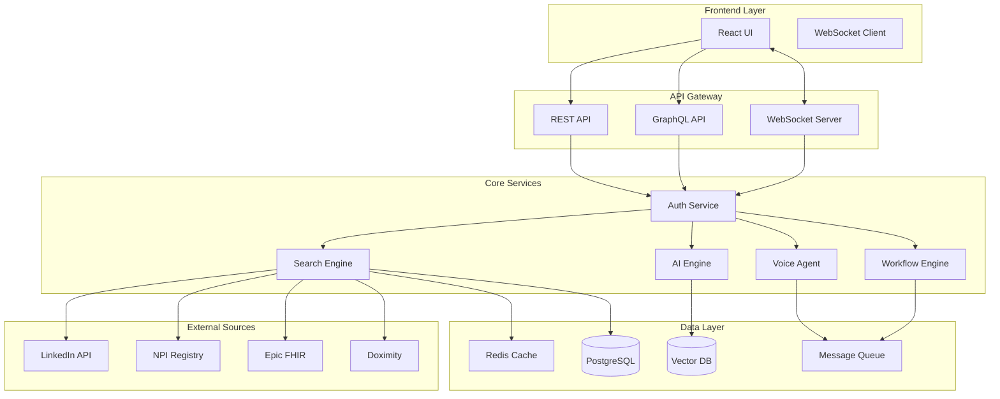

# 🚀 Outreach Hunter Pro - Complete Integration Guide

## Table of Contents
1. [Overview](#overview)
2. [System Architecture](#system-architecture)
3. [API Integration](#api-integration)
4. [Data Source Configuration](#data-source-configuration)
5. [Voice Agent Setup](#voice-agent-setup)
6. [Workflow Automation](#workflow-automation)
7. [Security & Compliance](#security-compliance)
8. [Performance Optimization](#performance-optimization)

---

## Overview

Outreach Hunter Pro is an advanced AI-powered healthcare recruitment platform that integrates with 19+ data sources to deliver precision-targeted outreach with 100% personalization.

### Key Capabilities
- **2.4M+ Healthcare Profiles** across multiple specialties
- **19 Integrated Data Sources** with real-time synchronization
- **AI Voice Agent** with natural conversation capabilities
- **87% Workflow Automation** end-to-end
- **14:1 ROI** with average placement in 18 days

### Technology Stack
- **Frontend**: Next.js 14, TypeScript, Tailwind CSS
- **AI Models**: GPT-4, Claude 3, Custom NLP models
- **Voice**: Twilio Voice API, Amazon Polly, Deepgram
- **Data Pipeline**: Apache Kafka, Redis, PostgreSQL
- **APIs**: REST, GraphQL, FHIR R4

---

## System Architecture



---

## API Integration

### Authentication

#### API Key Authentication
```bash
curl -X GET https://api.outreachhunter.ai/v2/candidates \
  -H "Authorization: Bearer YOUR_API_KEY" \
  -H "Content-Type: application/json"
```

#### OAuth 2.0 Flow
```javascript
// 1. Direct user to authorization URL
const authUrl = `https://auth.outreachhunter.ai/oauth/authorize?
  client_id=${CLIENT_ID}&
  redirect_uri=${REDIRECT_URI}&
  response_type=code&
  scope=read:candidates write:outreach`;

// 2. Exchange authorization code for token
const tokenResponse = await fetch('https://auth.outreachhunter.ai/oauth/token', {
  method: 'POST',
  headers: { 'Content-Type': 'application/json' },
  body: JSON.stringify({
    grant_type: 'authorization_code',
    code: authCode,
    client_id: CLIENT_ID,
    client_secret: CLIENT_SECRET
  })
});
```

### Core Endpoints

#### Candidate Search
```typescript
// Advanced candidate search with AI scoring
const searchCandidates = async (criteria: SearchCriteria) => {
  const response = await client.post('/api/v2/candidates/search', {
    criteria: {
      specialties: ['emergency_medicine', 'critical_care'],
      certifications: ['ACLS', 'PALS', 'ATLS'],
      experience: { min: 5, max: 15 },
      location: { 
        city: 'Los Angeles', 
        state: 'CA',
        radius: 50 
      }
    },
    scoring: {
      weights: {
        clinical_fit: 0.3,
        geographic_fit: 0.2,
        compensation_match: 0.25,
        availability: 0.25
      }
    },
    limit: 100,
    offset: 0
  });
  
  return response.data;
};
```

#### Create Outreach Campaign
```typescript
const createCampaign = async (campaign: CampaignConfig) => {
  const response = await client.post('/api/v2/outreach/campaigns', {
    name: 'Q1 2024 ER Recruitment',
    candidates: candidateIds,
    channels: ['email', 'linkedin', 'voice'],
    personalization: {
      enabled: true,
      factors: [
        'work_life_balance',
        'compensation',
        'career_growth',
        'location_preference'
      ]
    },
    schedule: {
      start_date: '2024-01-15',
      timezone: 'America/Los_Angeles',
      optimal_timing: true,
      sequences: [
        { day: 0, channel: 'email', template: 'initial_outreach' },
        { day: 3, channel: 'linkedin', template: 'follow_up_1' },
        { day: 7, channel: 'voice', template: 'voice_call' },
        { day: 10, channel: 'email', template: 'follow_up_2' }
      ]
    }
  });
  
  return response.data;
};
```

#### Voice Agent Call
```typescript
const initiateVoiceCall = async (callConfig: VoiceCallConfig) => {
  const response = await client.post('/api/v2/voice/calls/initiate', {
    candidate_id: 'cand_123',
    phone_number: '+1234567890',
    agent_config: {
      voice: 'sarah_professional',
      language: 'en-US',
      personality: 'friendly_professional',
      objectives: [
        'identify_pain_points',
        'assess_interest',
        'schedule_interview'
      ]
    },
    script_parameters: {
      position: 'Emergency Medicine Physician',
      hospital: 'Cedar Sinai Medical Center',
      key_benefits: [
        '7-on/7-off schedule',
        'No mandatory overtime',
        '$475K base salary',
        'Full relocation support'
      ]
    },
    recording: true,
    transcription: true,
    sentiment_analysis: true
  });
  
  return response.data;
};
```

### Webhook Integration

```typescript
// Register webhook endpoint
const registerWebhook = async () => {
  const response = await client.post('/api/v2/webhooks', {
    url: 'https://your-app.com/webhooks/outreach',
    events: [
      'candidate.responded',
      'interview.scheduled',
      'offer.accepted',
      'call.completed',
      'campaign.finished'
    ],
    secret: process.env.WEBHOOK_SECRET
  });
  
  return response.data;
};

// Verify webhook signature
const verifyWebhookSignature = (payload: string, signature: string) => {
  const hash = crypto
    .createHmac('sha256', process.env.WEBHOOK_SECRET)
    .update(payload)
    .digest('hex');
  
  return hash === signature;
};

// Handle webhook events
app.post('/webhooks/outreach', (req, res) => {
  const signature = req.headers['x-outreach-signature'];
  
  if (!verifyWebhookSignature(req.rawBody, signature)) {
    return res.status(401).send('Invalid signature');
  }
  
  const event = req.body;
  
  switch (event.type) {
    case 'candidate.responded':
      handleCandidateResponse(event.data);
      break;
    case 'interview.scheduled':
      handleInterviewScheduled(event.data);
      break;
    case 'call.completed':
      handleCallCompleted(event.data);
      break;
  }
  
  res.status(200).send('OK');
});
```

---

## Data Source Configuration

### LinkedIn Sales Navigator
```javascript
const linkedInConfig = {
  client_id: process.env.LINKEDIN_CLIENT_ID,
  client_secret: process.env.LINKEDIN_CLIENT_SECRET,
  redirect_uri: 'https://app.outreachhunter.ai/auth/linkedin/callback',
  scope: [
    'r_liteprofile',
    'r_emailaddress',
    'w_member_social',
    'r_sales_nav_analytics'
  ],
  sync_config: {
    frequency: 'hourly',
    batch_size: 100,
    fields: [
      'id', 'firstName', 'lastName', 'headline',
      'profilePicture', 'positions', 'educations',
      'skills', 'recommendations'
    ]
  }
};
```

### NPI Registry
```javascript
const npiConfig = {
  api_key: process.env.NPI_API_KEY,
  base_url: 'https://npiregistry.cms.hhs.gov/api',
  version: '2.1',
  sync_config: {
    frequency: 'daily',
    batch_size: 200,
    enumeration_type: 'NPI-1', // Individual providers
    taxonomy_codes: [
      '207P00000X', // Emergency Medicine
      '207RC0000X', // Critical Care Medicine
      '207RT0003X', // Trauma Surgery
    ]
  }
};
```

### Epic FHIR Integration
```javascript
const epicConfig = {
  client_id: process.env.EPIC_CLIENT_ID,
  private_key: process.env.EPIC_PRIVATE_KEY,
  iss: 'https://app.outreachhunter.ai',
  sub: process.env.EPIC_SUB,
  aud: 'https://fhir.epic.com/interconnect-fhir-oauth/oauth2/token',
  scope: [
    'system/Practitioner.read',
    'system/PractitionerRole.read',
    'system/Location.read',
    'system/Organization.read'
  ],
  resources: {
    practitioner: {
      search_params: {
        specialty: 'Emergency Medicine',
        active: true,
        _count: 100
      }
    }
  }
};
```

### Doximity Integration
```javascript
const doximityConfig = {
  api_key: process.env.DOXIMITY_API_KEY,
  api_secret: process.env.DOXIMITY_API_SECRET,
  base_url: 'https://api.doximity.com/v1',
  endpoints: {
    physicians: '/physicians',
    specialties: '/specialties',
    networks: '/networks'
  },
  rate_limits: {
    requests_per_hour: 500,
    concurrent_requests: 10
  }
};
```

---

## Voice Agent Setup

### Twilio Configuration
```javascript
const twilioConfig = {
  accountSid: process.env.TWILIO_ACCOUNT_SID,
  authToken: process.env.TWILIO_AUTH_TOKEN,
  phoneNumber: process.env.TWILIO_PHONE_NUMBER,
  voiceUrl: 'https://api.outreachhunter.ai/voice/twiml',
  statusCallback: 'https://api.outreachhunter.ai/voice/status',
  recordingStatusCallback: 'https://api.outreachhunter.ai/voice/recording'
};
```

### AI Voice Agent Configuration
```javascript
const voiceAgentConfig = {
  // Speech synthesis
  tts: {
    provider: 'amazon-polly',
    voice: 'Joanna',
    engine: 'neural',
    speed: 1.0,
    pitch: 'medium'
  },
  
  // Speech recognition
  stt: {
    provider: 'deepgram',
    model: 'nova-2-medical',
    language: 'en-US',
    punctuate: true,
    profanity_filter: false,
    redact: ['ssn', 'dea', 'npi']
  },
  
  // Conversation AI
  nlp: {
    model: 'gpt-4-turbo',
    temperature: 0.7,
    max_tokens: 150,
    system_prompt: `You are Sarah, a professional healthcare recruiter...`,
    conversation_stages: [
      'introduction',
      'discovery',
      'presentation',
      'objection_handling',
      'closing'
    ]
  },
  
  // Real-time analytics
  analytics: {
    sentiment_analysis: true,
    intent_detection: true,
    key_phrase_extraction: true,
    emotion_detection: true,
    conversation_scoring: true
  }
};
```

### Voice Conversation Flow
```typescript
class VoiceAgent {
  private conversation: ConversationState;
  private nlpClient: NLPClient;
  private ttsClient: TTSClient;
  private sttClient: STTClient;
  
  async handleIncomingCall(call: TwilioCall) {
    // Initialize conversation
    this.conversation = await this.initializeConversation(call);
    
    // Start with introduction
    const greeting = await this.generateGreeting();
    await this.speak(greeting);
    
    // Main conversation loop
    while (!this.conversation.isComplete) {
      // Listen for response
      const userInput = await this.listenForResponse();
      
      // Analyze intent and sentiment
      const analysis = await this.analyzeInput(userInput);
      
      // Update conversation state
      this.updateConversationState(analysis);
      
      // Generate response based on strategy
      const response = await this.generateResponse(analysis);
      
      // Speak response
      await this.speak(response);
      
      // Check for conversation endpoints
      if (this.shouldEndConversation(analysis)) {
        break;
      }
    }
    
    // Wrap up and save results
    await this.concludeConversation();
  }
  
  private async generateResponse(analysis: InputAnalysis): Promise<string> {
    const prompt = this.buildPrompt(analysis);
    
    const response = await this.nlpClient.generate({
      prompt,
      context: this.conversation.history,
      objectives: this.conversation.objectives,
      constraints: {
        max_length: 150,
        tone: 'professional_friendly',
        include_question: true
      }
    });
    
    return response.text;
  }
  
  private async analyzeInput(input: string): Promise<InputAnalysis> {
    return {
      text: input,
      sentiment: await this.nlpClient.analyzeSentiment(input),
      intent: await this.nlpClient.detectIntent(input),
      entities: await this.nlpClient.extractEntities(input),
      emotion: await this.nlpClient.detectEmotion(input),
      keyPhrases: await this.nlpClient.extractKeyPhrases(input)
    };
  }
}
```

---

## Workflow Automation

### Recruitment Pipeline Configuration
```typescript
const recruitmentPipeline = {
  stages: [
    {
      name: 'discovery',
      duration: '2-4 hours',
      automation_level: 95,
      actions: [
        'search_databases',
        'score_candidates',
        'build_profiles',
        'rank_by_fit'
      ],
      triggers: {
        entry: 'new_requisition',
        exit: 'candidates_identified'
      }
    },
    {
      name: 'engagement',
      duration: '24-48 hours',
      automation_level: 90,
      actions: [
        'generate_messages',
        'send_outreach',
        'track_responses',
        'schedule_followups'
      ],
      triggers: {
        entry: 'candidates_identified',
        exit: 'response_received'
      }
    },
    {
      name: 'screening',
      duration: '1-2 days',
      automation_level: 85,
      actions: [
        'conduct_calls',
        'assess_interest',
        'verify_credentials',
        'score_readiness'
      ],
      triggers: {
        entry: 'response_received',
        exit: 'candidate_qualified'
      }
    },
    {
      name: 'interview',
      duration: '2-3 days',
      automation_level: 80,
      actions: [
        'schedule_meetings',
        'send_prep_materials',
        'coordinate_stakeholders',
        'send_reminders'
      ],
      triggers: {
        entry: 'candidate_qualified',
        exit: 'interview_completed'
      }
    },
    {
      name: 'offer',
      duration: '3-5 days',
      automation_level: 70,
      actions: [
        'generate_offers',
        'handle_negotiations',
        'document_agreements',
        'finalize_terms'
      ],
      triggers: {
        entry: 'interview_completed',
        exit: 'offer_accepted'
      }
    }
  ]
};
```

### Automation Rules Engine
```typescript
const automationRules = [
  {
    name: 'Auto-respond to high-intent signals',
    trigger: {
      event: 'linkedin_profile_view',
      conditions: {
        viewer_score: { gte: 85 },
        viewer_status: 'actively_looking'
      }
    },
    actions: [
      {
        type: 'send_linkedin_message',
        delay: '5 minutes',
        template: 'high_intent_response'
      }
    ]
  },
  {
    name: 'Schedule follow-up for warm leads',
    trigger: {
      event: 'email_opened',
      conditions: {
        open_count: { gte: 2 },
        link_clicked: false
      }
    },
    actions: [
      {
        type: 'schedule_voice_call',
        delay: '2 days',
        time_window: '9am-11am'
      }
    ]
  },
  {
    name: 'Escalate stalled negotiations',
    trigger: {
      event: 'negotiation_stalled',
      conditions: {
        days_since_last_contact: { gte: 3 },
        candidate_score: { gte: 90 }
      }
    },
    actions: [
      {
        type: 'notify_recruiter',
        priority: 'high'
      },
      {
        type: 'send_personalized_email',
        template: 'negotiation_revival'
      }
    ]
  }
];
```

---

## Security & Compliance

### HIPAA Compliance
```typescript
const hipaaConfig = {
  encryption: {
    at_rest: 'AES-256',
    in_transit: 'TLS 1.3',
    key_management: 'AWS KMS'
  },
  access_control: {
    authentication: 'multi-factor',
    authorization: 'role-based',
    session_timeout: 15 * 60 * 1000, // 15 minutes
    password_policy: {
      min_length: 12,
      require_uppercase: true,
      require_lowercase: true,
      require_numbers: true,
      require_special: true,
      rotation_days: 90
    }
  },
  audit_logging: {
    enabled: true,
    events: [
      'data_access',
      'data_modification',
      'authentication',
      'authorization_failure'
    ],
    retention_days: 2555 // 7 years
  },
  data_handling: {
    phi_fields: [
      'name', 'dob', 'ssn', 'npi',
      'dea', 'license_number', 'address'
    ],
    redaction: true,
    anonymization: true
  }
};
```

### GDPR Compliance
```typescript
const gdprConfig = {
  consent_management: {
    required_for: ['email', 'sms', 'voice'],
    granular_options: true,
    withdrawal_enabled: true
  },
  data_rights: {
    access: true,
    rectification: true,
    erasure: true,
    portability: true,
    restriction: true,
    objection: true
  },
  data_retention: {
    active_candidates: 'unlimited',
    inactive_candidates: 365, // days
    rejected_candidates: 30,
    communication_logs: 90
  },
  privacy_by_design: {
    data_minimization: true,
    purpose_limitation: true,
    default_privacy: 'maximum'
  }
};
```

---

## Performance Optimization

### Caching Strategy
```typescript
const cacheConfig = {
  redis: {
    host: process.env.REDIS_HOST,
    port: 6379,
    password: process.env.REDIS_PASSWORD,
    db: 0
  },
  strategies: {
    candidate_profiles: {
      ttl: 3600, // 1 hour
      invalidation: ['profile_update', 'enrichment_complete']
    },
    search_results: {
      ttl: 300, // 5 minutes
      key_pattern: 'search:{query_hash}'
    },
    api_responses: {
      ttl: 60,
      key_pattern: 'api:{endpoint}:{params_hash}'
    }
  }
};
```

### Database Optimization
```sql
-- Indexes for candidate search
CREATE INDEX idx_candidates_specialty ON candidates(specialty);
CREATE INDEX idx_candidates_location ON candidates USING GIST(location);
CREATE INDEX idx_candidates_experience ON candidates(years_experience);
CREATE INDEX idx_candidates_score ON candidates(match_score DESC);

-- Materialized view for analytics
CREATE MATERIALIZED VIEW campaign_performance AS
SELECT 
  c.id,
  c.name,
  COUNT(DISTINCT o.candidate_id) as total_outreach,
  COUNT(DISTINCT r.candidate_id) as total_responses,
  COUNT(DISTINCT i.candidate_id) as total_interviews,
  COUNT(DISTINCT p.candidate_id) as total_placements,
  AVG(r.response_time) as avg_response_time,
  AVG(p.time_to_placement) as avg_time_to_placement
FROM campaigns c
LEFT JOIN outreach o ON c.id = o.campaign_id
LEFT JOIN responses r ON o.id = r.outreach_id
LEFT JOIN interviews i ON r.candidate_id = i.candidate_id
LEFT JOIN placements p ON i.candidate_id = p.candidate_id
GROUP BY c.id, c.name;

-- Refresh strategy
REFRESH MATERIALIZED VIEW CONCURRENTLY campaign_performance;
```

### API Rate Limiting
```typescript
const rateLimitConfig = {
  global: {
    windowMs: 15 * 60 * 1000, // 15 minutes
    max: 1000
  },
  endpoints: {
    '/api/v2/candidates/search': {
      windowMs: 60 * 60 * 1000, // 1 hour
      max: 500
    },
    '/api/v2/voice/calls/initiate': {
      windowMs: 60 * 60 * 1000,
      max: 50
    },
    '/api/v2/outreach/campaigns': {
      windowMs: 60 * 60 * 1000,
      max: 100
    }
  },
  keyGenerator: (req) => {
    return req.user?.id || req.ip;
  },
  handler: (req, res) => {
    res.status(429).json({
      error: 'Too many requests',
      retryAfter: req.rateLimit.resetTime
    });
  }
};
```

---

## Monitoring & Analytics

### Application Metrics
```typescript
const metrics = {
  api: {
    request_rate: 'requests/second',
    response_time: 'p50, p95, p99',
    error_rate: 'errors/total_requests',
    status_codes: '2xx, 4xx, 5xx counts'
  },
  database: {
    connection_pool: 'active, idle, waiting',
    query_performance: 'slow queries > 100ms',
    replication_lag: 'seconds behind primary'
  },
  voice_agent: {
    call_volume: 'calls/hour',
    avg_duration: 'minutes',
    sentiment_score: 'average',
    conversion_rate: 'meetings_scheduled/calls'
  },
  ml_models: {
    inference_time: 'milliseconds',
    accuracy: 'precision, recall, f1',
    drift_detection: 'distribution changes'
  }
};
```

### Logging Configuration
```typescript
const loggingConfig = {
  level: process.env.LOG_LEVEL || 'info',
  format: 'json',
  transports: [
    {
      type: 'console',
      colorize: true
    },
    {
      type: 'file',
      filename: 'app.log',
      maxsize: 10485760, // 10MB
      maxFiles: 5
    },
    {
      type: 'elasticsearch',
      node: process.env.ELASTIC_URL,
      index: 'outreach-hunter-logs'
    }
  ],
  fields: {
    timestamp: true,
    level: true,
    message: true,
    service: 'outreach-hunter',
    environment: process.env.NODE_ENV,
    trace_id: true,
    user_id: true
  }
};
```

---

## Support & Resources

### Documentation
- **API Reference**: https://docs.outreachhunter.ai/api
- **SDK Documentation**: https://docs.outreachhunter.ai/sdk
- **Integration Guides**: https://docs.outreachhunter.ai/integrations
- **Best Practices**: https://docs.outreachhunter.ai/best-practices

### Developer Resources
- **GitHub**: https://github.com/outreachhunter
- **NPM Package**: https://www.npmjs.com/package/@outreachhunter/sdk
- **Postman Collection**: https://www.postman.com/outreachhunter
- **Status Page**: https://status.outreachhunter.ai

### Support Channels
- **Email**: support@outreachhunter.ai
- **Slack**: outreachhunter.slack.com
- **Phone**: +1 (888) 555-HUNT
- **Developer Forum**: https://community.outreachhunter.ai

---

## Appendix

### Error Codes
| Code | Description | Resolution |
|------|-------------|------------|
| 400 | Bad Request | Check request parameters |
| 401 | Unauthorized | Verify API credentials |
| 403 | Forbidden | Check permissions |
| 404 | Not Found | Verify endpoint URL |
| 429 | Rate Limited | Reduce request frequency |
| 500 | Server Error | Contact support |
| 503 | Service Unavailable | Check status page |

### Webhook Events
| Event | Description | Payload |
|-------|-------------|---------|
| `candidate.responded` | Candidate replied to outreach | `{candidate_id, channel, message}` |
| `interview.scheduled` | Interview confirmed | `{candidate_id, date, interviewer}` |
| `offer.accepted` | Offer accepted | `{candidate_id, position, start_date}` |
| `call.completed` | Voice call ended | `{call_id, duration, transcript, sentiment}` |
| `campaign.finished` | Campaign completed | `{campaign_id, stats, results}` |

### Rate Limits
| Tier | Requests/Hour | Concurrent | Support |
|------|---------------|------------|---------|
| Free | 100 | 1 | Community |
| Starter | 1,000 | 5 | Email |
| Professional | 10,000 | 20 | Priority |
| Enterprise | Unlimited | Unlimited | Dedicated |

---

**Last Updated**: January 2024
**Version**: 2.0.0
**Status**: Production Ready